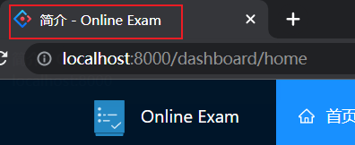
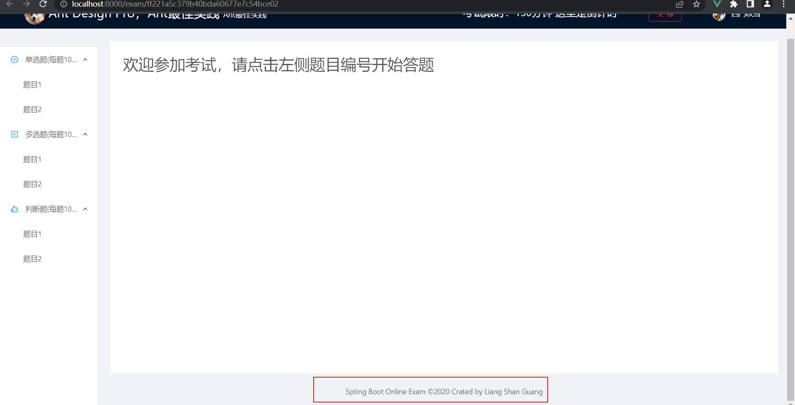
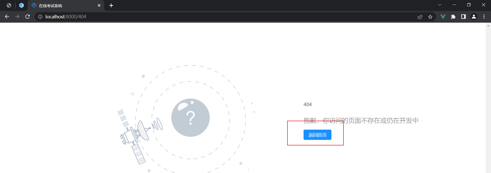
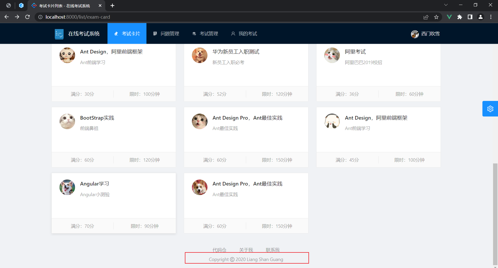

# 在线考试系统

登录页面:

layouts/UserLayout.vue

views/user/Login.vue

首页：

views/home/(分成了几个组件)

然后再 views/Home.vue(在大写的Home用上)

logo：

components/tools/Logo.vue

浏览器标题：

utils/domUtil.js

views/list/ExamDetail.vue

layouts/UserLayout.vue

components/Exception/ExceptionPage.vue

components/GlobalFooter/GlobalFooter.vue

